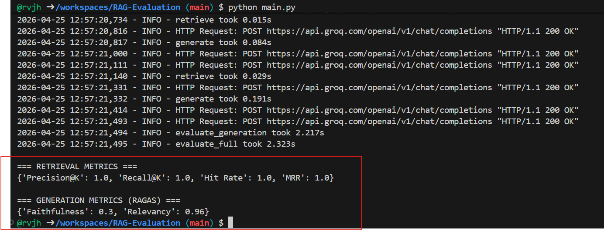
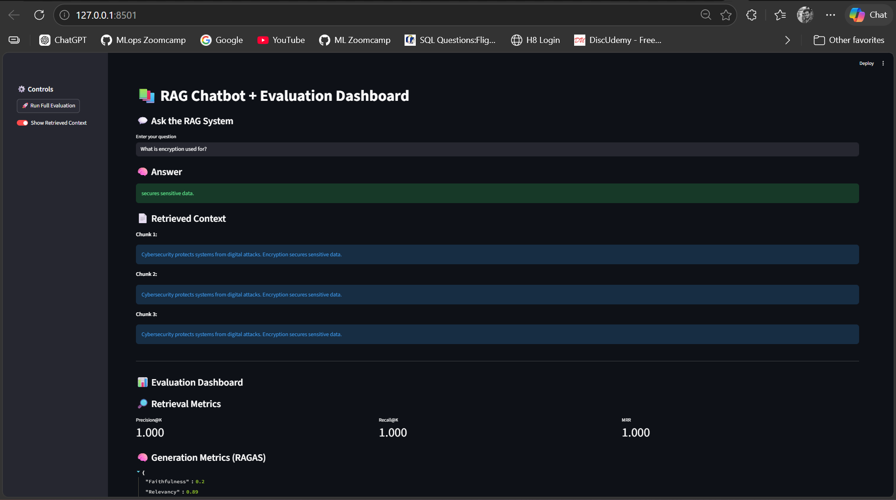

# RAG Evaluation Project

End-to-end Retrieval-Augmented Generation (RAG) demo with:
- Document ingestion and vector indexing (ChromaDB)
- Context retrieval + answer generation (Groq LLM)
- Retrieval and generation quality evaluation (custom metrics + RAGAS)
- Streamlit UI for chatting and dashboard metrics

## Use Case Name

`RAG Chatbot Quality Evaluation for Domain Documents`

## Objective

Build and evaluate a lightweight RAG system that can:
- Answer user questions using local text documents as context
- Measure retrieval quality with `Precision@K`, `Recall@K`, and `MRR`
- Measure generation quality using RAGAS (`faithfulness`, `answer_relevancy`)
- Provide an interactive UI to test responses and view evaluation metrics

## Project Structure

- `app.py` - Streamlit app (chat + evaluation dashboard)
- `main.py` - CLI-style quick run for answer + evaluation output
- `core/ingestion.py` - Loads text files, chunks, and stores embeddings in Chroma
- `core/retrieval.py` - Retrieves top-k relevant chunks
- `core/generation.py` - Calls Groq LLM with retrieved context
- `core/rag.py` - Orchestrates ingestion, retrieval, and generation
- `evaluation/evaluation.py` - Retrieval and generation metric calculation
- `config/config.py` - API key, model names, and path configuration
- `data/documents/` - Source knowledge documents
- `data/golden_dataset.json` - Ground-truth Q&A for evaluation






## Procedures

### 1) Prerequisites

- Python 3.9+ (recommended: 3.10 or 3.11)
- Groq API key
- Internet connection (for model/API calls and some dependencies)

### 2) Setup Environment

From project root:

```bash
python -m venv .venv
```

Activate virtual environment:

Windows (PowerShell):
```powershell
.venv\Scripts\Activate.ps1
```

Install dependencies:

```bash
pip install -r requirements.txt
```

### 3) Configure Environment Variables

Create `.env` in the project root:

```env
GROQ_API_KEY=your_groq_api_key_here
```

### 4) Prepare Knowledge Base

- Put `.txt` files inside `data/documents/`
- Existing sample files are already present

### 5) Run the Streamlit App

```bash
streamlit run app.py
```

Then:
- Ask a question in the chat box
- Optionally enable/disable retrieved context display
- Click **Run Full Evaluation** from the sidebar to compute metrics

### 6) Run from CLI (Optional)

```bash
python main.py
```

This prints:
- One sample generated answer
- Retrieval metrics
- Generation metrics

## Evaluation Details

### Retrieval Metrics

- `Precision@K`: fraction of top-k retrieved chunks containing expected answer text
- `Recall@K`: whether any top-k chunk contains expected answer text
- `MRR`: rank quality of first relevant retrieved chunk

### Generation Metrics (RAGAS)

- `faithfulness`: answer consistency with retrieved context
- `answer_relevancy`: alignment of answer to the input question

## Input Data Format

Golden dataset (`data/golden_dataset.json`) should follow:

```json
[
  {
    "question": "Your question here",
    "ground_truth": "Expected factual answer here"
  }
]
```

## Default Configuration

From `config/config.py`:
- Embedding model: `sentence-transformers/all-MiniLM-L6-v2`
- LLM model: `llama3-8b-8192`
- Chunk size: `100`
- Chunk overlap: `20`
- Vector DB path: `./chroma_db`
- Document path: `./data/documents`

## Troubleshooting

- **Missing API key**
  - Ensure `.env` exists and `GROQ_API_KEY` is set correctly.
- **No retrieval context**
  - Verify `.txt` files exist in `data/documents/`.
- **Dependency issues**
  - Recreate virtual environment and reinstall from `requirements.txt`.
- **Slow first run**
  - Initial embedding/vector DB creation can take longer.

## Future Improvements

- Add larger and more diverse golden dataset
- Add source citations in final responses
- Add automated tests for ingestion/retrieval/evaluation
- Add experiment tracking for metric comparison across model versions
